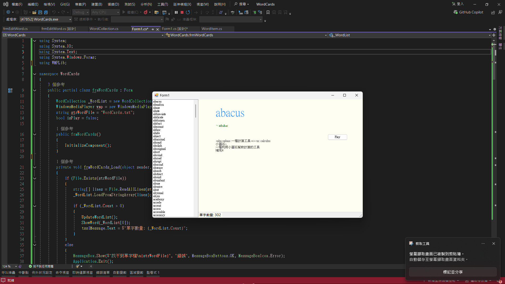

# 📇 WordCards 單字卡學習程式 (Vocabulary Flashcards)

> **課程名稱**：視窗程式設計 (II) - 資料檔讀取與自訂類別集合
> **專案目標**：開發一款具備音效發音、自動輪播與即時編輯功能的桌面端單字卡學習應用程式。

---

## 📝 專案概述
本專案為 TSV 資料解析程式的進階升級版。除了延續物件導向 (OOP) 的資料封裝設計外，更深度整合了 Windows Media Player (COM 元件) 以支援 `.mp3` 真人語音發音。系統具備自動播放模式與鍵盤快捷鍵操作，並支援雙擊單字清單進行資料修改與實體檔案回存，提供完整且流暢的數位學習體驗。

---

## 🚀 核心功能與技術亮點

### 1. 🎵 多媒體與自動播放整合
* **語音發音 (`WMPLib`)**：無縫串接 Windows Media Player，根據單字資料夾路徑動態載入並播放對應的 `.mp3` 音效檔。
* **自動輪播機制 (`Timer`)**：利用 `Timer` 控制項實作自動播放功能，每隔兩秒自動跳轉至下一個單字並發音，並確保 ListView 的焦點永遠保持在視窗中央。

### 2. ⌨️ 快捷互動與動態排版
* **全域鍵盤監聽**：開啟表單的 `KeyPreview` 屬性，實作按下 `Enter` 鍵跳至下一個單字、按下 `Space` (空白鍵) 重複播放當前單字發音的快捷操作。
* **無邊框 UI 偽裝術**：透過設定 TextBox 的 `BorderStyle = None` 與背景色同化 (`BackColor = 255, 254, 242`)，打破傳統輸入框的視覺限制，營造乾淨流暢的閱讀版面。
* **響應式佈局 (`Anchor` & `Dock`)**：精準設定各控制項的邊緣錨點，確保視窗放大縮小或最大化時，介面元素能完美自適應縮放而不跑版。

### 3. 💾 資料雙向互動與回存
* **即時編輯 (`frmEditWord`)**：於 ListView 實作雙擊 (`DoubleClick`) 事件，呼叫獨立的編輯對話方塊。使用者可即時修改單字、音標、路徑與解釋。
* **資料持久化 (`SaveToFile`)**：在自訂集合 `WordCollection` 中擴充存檔方法，透過 `StreamWriter` 將記憶體中修改後的單字陣列，依循 TSV 格式 (`\t` 分隔) 完美覆寫回實體文字檔 (`WordCards.txt`)。

---

## 📁 專案架構說明
* `frmWordCards.cs`：主視窗程式碼，負責處理清單點擊、自動播放邏輯與全域鍵盤事件。
* `frmEditWord.cs`：單字編輯對話方塊，透過 `DialogResult` 與主視窗同步更新狀態。
* `WordItem.cs`：單字資料實體，內建字串解析與 `ToLineString` TSV 格式化輸出功能。
* `WordCollection.cs`：繼承自泛型集合的自訂管理類別，集中封裝資料的載入與寫入邏輯。

---

## 💻 執行畫面
*(請將您的程式執行畫面截圖命名為 screenshot.png 並放置於專案根目錄)*

---

**⚠️ 執行注意事項**：
1. 確保欲讀取的來源文字檔 (`WordCards.txt`) 與 `Sound` 音效資料夾已放置於專案目錄下。
2. 相關資源檔案的屬性必須設定為 **「有更新時才複製 (Copy if newer)」**，否則將導致讀取失敗或無法播放音效。
